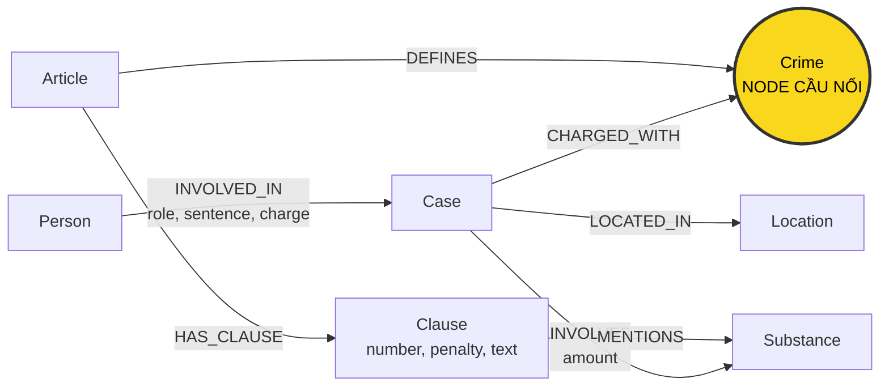

# Thiết kế Ontology — Day 19

**Họ tên:** Trần Gia Thành  **MSSV:** 2A202602626

**Lựa chọn** (đánh dấu một):
- [x] Dùng ontology gợi ý (có thể chỉnh nhỏ)
- [ ] Tự thiết kế (xét bonus +15, xem `SUBMISSION.md`)

> Hướng dẫn: `LAB_GUIDE.md` Bước 2. Dùng ontology gợi ý thì vẫn phải điền đủ các mục dưới đây bằng lời của bạn.

## 1. Sơ đồ

Vẽ bằng mermaid (hoặc chèn ảnh `report/img/ontology.png`). Đánh dấu rõ **node cầu nối**.

## 2. Entity types (node labels)

| Label | Ý nghĩa | Khóa định danh (`MERGE` theo) | Properties | Lấy từ KB nào | Trích bằng (regex / LLM / khác) |
| --- | --- | --- | --- | --- | --- |
| `Article` | Một điều luật | `id` | `id`, `title`, `law`, `doc_id` | Luật | Metadata và regex |
| `Clause` | Một khoản trong điều luật | `id` | `id`, `number`, `penalty`, `text`, `doc_id` | Luật | Regex |
| `Crime` | Tội danh chuẩn hóa | `name` | `name` | Luật và tin tức | Regex/chuẩn hóa từ luật; LLM và `link_entity` từ tin |
| `Case` | Một vụ việc hoặc vụ án được bài báo đề cập | `name` | `name`, `summary`, `date`, `doc_id`, `source_title` | Tin tức | LLM |
| `Person` | Người liên quan đến vụ việc | `name` | `name`, `aliases` | Tin tức | LLM |
| `Substance` | Loại chất ma túy | `name` | `name` | Luật và tin tức | So khớp danh sách ở luật; LLM ở tin |
| `Location` | Địa điểm của vụ việc | `name` | `name` | Tin tức | LLM |

## 3. Relationships

| Type | Từ → Đến | Properties trên cạnh | Ý nghĩa |
| --- | --- | --- | --- |
| `DEFINES` | `Article` → `Crime` | Không có | Điều luật quy định tội danh |
| `HAS_CLAUSE` | `Article` → `Clause` | Không có | Điều luật chứa một khoản |
| `MENTIONS` | `Clause` → `Substance` | Không có | Khoản luật đề cập đến loại chất ma túy |
| `CHARGED_WITH` | `Case` → `Crime` | Không có | Vụ việc liên quan đến tội danh được luật định nghĩa |
| `INVOLVES` | `Case` → `Substance` | `amount` | Vụ việc có loại và khối lượng chất ma túy này |
| `LOCATED_IN` | `Case` → `Location` | Không có | Vụ việc xảy ra hoặc được xử lý tại địa điểm này |
| `INVOLVED_IN` | `Person` → `Case` | `role`, `sentence`, `charge` | Người tham gia vụ việc với vai trò, tội danh và mức án tương ứng |

## 4. Node cầu nối giữa 2 KB

- **Node nào:** `Crime` (tội danh).
- **Vì sao chọn node này:** Phía luật có đường `Article -[:DEFINES]-> Crime`, còn phía tin tức có đường `Case -[:CHARGED_WITH]-> Crime`. Nhờ cùng trỏ đến một node `Crime`, hệ thống có thể đi từ người/vụ án trong tin sang điều luật và các khung hình phạt tương ứng.
- **Cách đảm bảo hai phía khớp tên** (chuẩn hóa, `link_entity`, danh sách chuẩn trong prompt…): Tên tội từ tiêu đề điều luật được chuẩn hóa bằng `normalize_crime` (đưa về chữ thường, bỏ khoảng trắng thừa, dấu ngoặc kép và tiền tố "Tội"). Khi trích xuất tin, prompt cung cấp danh sách tội danh chuẩn lấy từ KB luật. Kết quả của LLM tiếp tục đi qua `link_entity`, ưu tiên khớp chính xác sau chuẩn hóa, rồi mới khớp gần với ngưỡng `0.8`; giá trị được giữ theo đúng cách viết trong danh sách chuẩn.
- **Khi nào cầu gãy, và bạn xử lý thế nào:** Cầu gãy khi bài báo không nêu tội danh, LLM bỏ sót/trích sai, hoặc cách gọi khác quá nhiều nên `link_entity` không đạt ngưỡng. Khi đó hàm trả về `None` và không tạo cạnh `CHARGED_WITH`, tránh nối nhầm sang điều luật. Có thể cải thiện bằng cách bổ sung từ đồng nghĩa, danh sách tên chuẩn và kiểm tra thủ công các trường hợp không khớp.

## 5. Competency questions

Với mỗi câu trong `data/benchmark_kg.json`, ghi đường đi trên graph dùng để trả lời. Câu nào không trả lời được thì ghi rõ lý do.

| Câu | Đường đi (Cypher pattern) | Trả lời được? |
| --- | --- | --- |
| Q1 | `(:Article)-[:HAS_CLAUSE]->(:Clause)`; tìm điều luật có nội dung định nghĩa "tiền chất" và đọc `Clause.text` | Có, nếu điều luật định nghĩa được vector retrieval chọn làm tài liệu đầu vào |
| Q2 | `(:Person)-[r:INVOLVED_IN]->(:Case)`; lọc đúng vụ xét xử ngày 28-9 và đọc `r.sentence` | Có |
| Q3 | `(:Person {name:'Lê Minh Thành'})-[r:INVOLVED_IN]->(:Case)-[:CHARGED_WITH]->(:Crime)<-[:DEFINES]-(:Article)-[:HAS_CLAUSE]->(:Clause {number:1})` | Có; `r.sentence` cho mức án, `Crime` cho tội danh, `Article` và `Clause` cho căn cứ luật |
| Q4 | `(:Person)-[:INVOLVED_IN]->(:Case)-[:CHARGED_WITH]->(:Crime)<-[:DEFINES]-(:Article)-[:HAS_CLAUSE]->(:Clause)`; tìm người có alias `Hoàng Nato` và lấy khoản có khung cao nhất | Có |
| Q5 | `(:Person {name:'Cái Quang Huy'})-[:INVOLVED_IN]->(k:Case)-[:INVOLVES]->(:Substance {name:'MDMA'})` và `(k)-[:CHARGED_WITH]->(:Crime)<-[:DEFINES]-(:Article)-[:HAS_CLAUSE]->(:Clause)-[:MENTIONS]->(:Substance {name:'MDMA'})` | Có; LLM đọc `amount` của vụ và ngưỡng khối lượng trong `Clause.text` để chọn khoản 4 |
| Q6 | `(k:Case)-[:INVOLVES]->(:Substance {name:'MDMA'})` rồi lấy tất cả `k.name`, `k.summary` và người liên quan | Có |

## 6. Quyết định thiết kế và đánh đổi

Ít nhất 3 quyết định. Mỗi quyết định ghi: đã chọn gì, phương án khác là gì, vì sao chọn.

1. **Chọn `Crime` làm node cầu nối.** Phương án khác là nối trực tiếp `Case` với `Article`. Node `Crime` được chọn vì nhiều vụ án có thể cùng một tội danh và cùng dùng lại một điều luật; thiết kế này giảm cạnh trùng và thể hiện rõ ý nghĩa pháp lý. Đánh đổi là chất lượng truy vấn xuyên KB phụ thuộc vào việc chuẩn hóa tên tội chính xác.
2. **Lưu mức án trên quan hệ `INVOLVED_IN`.** Phương án khác là tạo node `Sentence` riêng hoặc lưu mức án trên `Person`. Mức án thuộc về một người trong một vụ cụ thể nên đặt trên cạnh là phù hợp và giữ graph gọn. Đánh đổi là khó chuẩn hóa, tổng hợp hoặc so sánh các loại hình phạt vì mức án vẫn là chuỗi văn bản.
3. **Lưu khối lượng trong property `amount` của quan hệ `INVOLVES`.** Phương án khác là tạo node `Evidence`/`DrugQuantity` riêng. Khối lượng phụ thuộc vào cặp vụ án–chất ma túy nên đặt trên cạnh giúp mô hình đơn giản. Đánh đổi là `amount` chưa được tách thành số và đơn vị, vì vậy LLM phải đọc chuỗi để so với ngưỡng trong luật.
4. **Tách `Article` và `Clause` thành hai loại node.** Phương án khác là lưu toàn bộ điều luật trong một node. Việc tách khoản giúp truy xuất đúng khung hình phạt và giới hạn lượng văn bản đưa vào prompt. Đánh đổi là graph có nhiều node/cạnh hơn và việc truy vấn phải đi thêm một bước.
5. **Dùng regex cho luật và LLM cho tin tức.** Luật có cấu trúc ổn định nên regex cho kết quả nhanh và lặp lại được; tin báo có cách viết tự do nên cần LLM. Đánh đổi là trích xuất từ tin có thể không ổn định hoặc bỏ sót dữ kiện.

## 7. So với ontology gợi ý (bắt buộc nếu xét bonus)

| Điểm khác | Gợi ý làm gì | Bạn làm gì | Vấn đề nó giải quyết | Bằng chứng (Cypher, hoặc số liệu benchmark) |
| --- | --- | --- | --- | --- |
| Không áp dụng | Dùng ontology gợi ý | Dùng nguyên ontology gợi ý, không xét bonus tự thiết kế | Không áp dụng | Không áp dụng |

## 8. Hạn chế còn lại

- `Case` và `Person` dùng tên do LLM trích xuất làm khóa nên cùng một thực thể có thể bị tách thành nhiều node, hoặc hai thực thể khác nhau có tên giống nhau có thể bị gộp.
- `Substance` chỉ so khớp theo tên chuẩn và chưa có cơ chế đầy đủ để gộp tên đồng nghĩa/tên đường phố.
- `amount`, `sentence` và ngưỡng khối lượng trong `Clause.text` vẫn là chuỗi, chưa được chuẩn hóa thành số, đơn vị và cận dưới/cận trên để so sánh chắc chắn bằng Cypher.
- Ontology chưa mô hình hóa riêng các giai đoạn tố tụng như bắt giữ, khởi tố, truy tố, xét xử và phúc thẩm.
- Nếu bài báo không nêu rõ tội danh hoặc `link_entity` không tìm được tên tương ứng, cạnh nối từ `Case` sang `Crime` sẽ thiếu và truy vấn xuyên hai KB không đi được.
